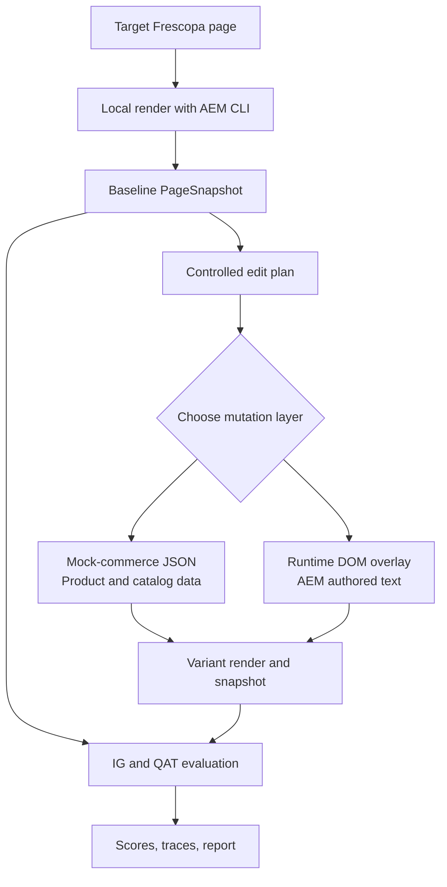

# Content Experiment Runner

Goal: programmatically test whether content edits improve Frescopa's
Information Gain and AI-mediated discovery performance.

V1 should support this loop:

1. Render a target Frescopa page locally with AEM CLI.
2. Capture the baseline page: final DOM, visible text, key products/sections,
   screenshot, and URL metadata.
3. Generate a controlled edit plan.
4. Apply the variant through one of the supported mutation surfaces.
5. Re-render and evaluate baseline vs variant.
6. Save the run artifacts and a short comparison report.



## Mutations On Two Layers

- **Mock-commerce JSON** for product/catalog content.
  For product names, descriptions, prices, images,
  categories, and PDP/PLP data. Edit `tools/mock-commerce/responses/*.json`,
  then regenerate PDP mocks with:

  ```powershell
  node tools/mock-commerce/synthesize-pdp.mjs
  ```

- **Runtime DOM overlays** for AEM-authored text.
  Use Playwright to render the real page, identify editable text nodes, apply
  temporary edits in the browser, then evaluate the modified page.

Tradeoff: mock-commerce edits are persistent and reproducible, but only cover
commerce data. DOM overlays can test headings, banners, and marketing copy, but
they are evaluation-only and do not write back to AEM.

Static HTML snapshots can be added later for cheap text-only experiments, but
they are lower fidelity and should not be the main V1 path.

## Evaluation

Keep the evaluation aligned with `Experiments/Docs/main_abs1.tex`. (Check section 2.3)

Topic clusters (defined by queries as ground truth), but preferably something like:

- `C1`: coffee subscriptions and recurring delivery;
- `C2`: beans by roast or flavor profile;
- `C3`: machine compatibility and brewing guidance;
- `C4`: coffee quiz or guided selection;
- `C5`: bundles, gifts, and offers;
- `C6`: accessories and related products.

IG dimensions:

- specificity and boundedness;
- structured answerability;
- evidence quality;
- differentiation;
- novelty relative to the reference set.

QAT metrics:

- presence: whether Frescopa appears in the generated answer;
- prominence: where Frescopa appears;
- citation/share: how much the answer depends on Frescopa content;
- alignment: whether the answer says what the page intends to say.

### Goal:
When a variant fails, record the failure type: visibility gap, narrative
misalignment, hollow IG, drift after revision, or cross-channel inconsistency.

## Runner Output

Store each run under:

```text
Experiments/outputs/content-runs/<run_id>/
```

Minimum artifacts:

- `run.json`: config, page URL, cluster, timestamps;
- `baseline/page.json`: extracted baseline model;
- `variant/manifest.json`: applied edits;
- `variant/page.json`: extracted variant model;
- `scores.json`: IG and QAT metric comparison;
- `report.md`: concise human-readable summary.

Add HTML snapshots and screenshots once the basic loop is stable.

## First Build

1. Build a Playwright extractor that opens a local page and returns a
   `PageSnapshot`: URL, title, headings, visible text, sections, product cards,
   CTAs, links, and stable text anchors.
2. Build the mutation layer:
   - product/catalog edits through mock-commerce JSON;
   - AEM-authored text edits through DOM overlays.
3. Build a baseline-vs-variant runner that saves artifacts for both versions.
4. Add a small IG scorer for the main dimensions.
5. Add a minimal QAT evaluator using a versioned prompt set per cluster.
6. Generate a compact report showing the edit, expected improvement, measured
   delta, and any failure mode.

## Guardrails

- Keep edits small, targeted, and attributable.
- Require each edit to target a product field, selector, or text anchor.
- Do not let the agent rewrite an entire page.
- Preserve product facts unless the experiment explicitly changes them.
- Treat DOM variants as evaluation artifacts, not source-of-truth content.
- Version prompts, judge prompts, and run configs.
