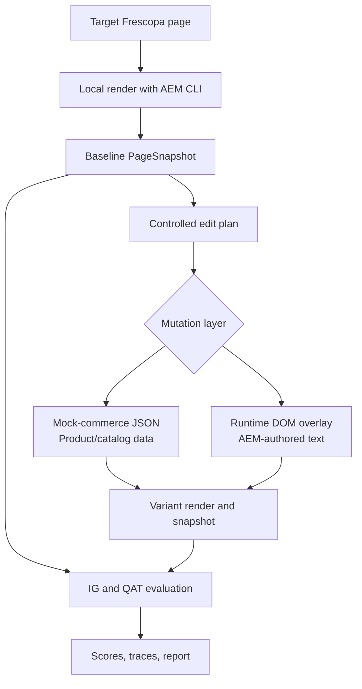

# Content Experiment Runner And IG Implementation Plan

This is the source of truth for the Frescopa Information Gain and content
experiment work.

## Current Assumptions

- Frescopa is the current project target.
- V1 uses one topic cluster only: `unknown`.
- `unknown` represents the entire current Frescopa cluster until we split pages
  and prompts into narrower clusters later.
- Frescopa claims live in `Experiments/data/example_claims_config.json`.
- The old Lovesac claim config is obsolete and should not be used.
- Next queued milestone: implement the Section 2.1 page-level Information Gain
  scorer.

## Goal

Programmatically test whether content edits improve Frescopa's Information Gain
and AI-mediated discovery performance.

V1 should support this loop:

1. Render a target Frescopa page locally with AEM CLI.
2. Capture the baseline page as a structured `PageSnapshot`.
3. Generate or provide a controlled edit plan.
4. Apply the variant through product mock JSON or a runtime DOM overlay.
5. Re-render and evaluate baseline vs variant.
6. Save artifacts and a short comparison report.



## Quick Commands

Install dependencies once:

```bash
npm install
```

Run the local AEM dev server:

```bash
npx -y @adobe/aem-cli up --url https://main--frescopa--andreibbarbu.aem.page --no-open
```

Open:

```text
http://localhost:3000
```

Inspect rendered/local output:

```bash
curl http://localhost:3000/
curl http://localhost:3000/index.plain.html
curl http://localhost:3000/index.md
```

Find the ProductSearch mock file for a SKU on PowerShell:

```powershell
Select-String -Path tools\mock-commerce\responses\*.json -Pattern '"sku": "HBDR212"' |
  Select-Object -ExpandProperty Path -Unique
```

Equivalent shell command:

```bash
grep -l '"sku": "HBDR212"' tools/mock-commerce/responses/*.json
```

Regenerate PDP mocks after editing ProductSearch data:

```bash
node tools/mock-commerce/synthesize-pdp.mjs
```

## Local Rendering Model

The local page is:

```text
AEM preview content
  -> served through local AEM CLI
  -> decorated by Edge Delivery Services code in this repo
  -> enriched with mocked commerce data from tools/mock-commerce
```

Useful files:

- `LOCAL_DEV.md`: local server and AEM preview proxy.
- `MODIFY_CONTENT.md`: product/catalog mock editing guide.
- `head.html`: loads `scripts/mock-commerce.js` before commerce/dropin code.
- `scripts/mock-commerce.js`: intercepts known Commerce GraphQL fetches.
- `tools/mock-commerce/responses/*.json`: product/catalog mutation surface.
- `tools/mock-commerce/synthesize-pdp.mjs`: regenerates PDP mock responses.
- `scripts/scripts.js`: main page loading and decoration entry point.
- `scripts/aem.js`: core EDS helper library. Do not modify for experiments.
- `blocks/product-list-page-custom/product-list-page-custom.js`: PLP query and
  product loading.
- `blocks/product-list-page-custom/ProductList.js`: rendered product cards.
- `scripts/initializers/pdp.js`: PDP SKU and product-data initialization.
- `blocks/product-details/product-details.js`: PDP rendering.

## Mutation Surfaces

### Product Mock JSON

Use product mock edits for product/catalog content:

- product names;
- short descriptions;
- prices;
- images;
- category and PLP/PDP data.

Edit the `ProductSearch` file, not the generated `GET_PRODUCT_DATA` file. The
PDP mocks are regenerated from ProductSearch data.

Concrete example for SKU `HBDR212`:

```text
Source file: tools/mock-commerce/responses/4c7efb5dc3172d4a.json
Product path: /products/hbdr212/hbdr212
Fields: productView.name, productView.shortDescription, productView.price
```

Example ProductSearch edit:

```json
{
  "productView": {
    "name": "House Blend - Dark Roast",
    "sku": "HBDR212",
    "shortDescription": "Dark roast coffee with chocolate notes, toasted nuts, and a smooth smoky finish.",
    "urlKey": "hbdr212",
    "images": [
      {
        "url": "__MOCK_ORIGIN__/mock-assets/urn_aaid_aem_5f861728-7e97-4513-ab01-d6d174f244d6.avif"
      }
    ],
    "price": {
      "regular": {
        "amount": {
          "currency": "USD",
          "value": 14.99
        }
      },
      "final": {
        "amount": {
          "currency": "USD",
          "value": 14.99
        }
      }
    }
  }
}
```

Manual workflow:

```text
1. Open http://localhost:3000/coffee and identify the SKU.
2. Find the ProductSearch JSON file that contains the SKU.
3. Edit productView.name, productView.shortDescription, price, or image URL.
4. Run node tools/mock-commerce/synthesize-pdp.mjs.
5. Hard-refresh the PLP/PDP or open a fresh browser context.
```

Automation contract:

```python
def mutate_product(search_response_file, sku, patch):
    data = read_json(search_response_file)

    for item in data["data"]["productSearch"]["items"]:
        product = item["productView"]
        if product["sku"] != sku:
            continue

        if "name" in patch:
            product["name"] = patch["name"]
        if "shortDescription" in patch:
            product["shortDescription"] = patch["shortDescription"]
        if "price" in patch:
            product["price"]["regular"]["amount"]["value"] = patch["price"]
            product["price"]["final"]["amount"]["value"] = patch["price"]

    write_json(search_response_file, data)
    run("node tools/mock-commerce/synthesize-pdp.mjs")
```

### Runtime DOM Overlays

Use DOM overlays for AEM-authored text:

- headings;
- banners;
- marketing copy;
- CTAs;
- lists;
- FAQ-like content.

DOM overlays are evaluation-only and do not write back to AEM. The agent must
return edits by generated node ID, not invented selectors.

Example edit output:

```json
{
  "edits": [
    {
      "id": "n002",
      "replacement": "Explore dark roast coffee with deep chocolate notes, toasted nuts, and a smooth finish."
    }
  ]
}
```

DOM application contract:

```python
async def apply_dom_edits(page, edits):
    await page.evaluate("""
    (edits) => {
      for (const edit of edits) {
        const el = document.querySelector(`[data-exp-id='${edit.id}']`);
        if (!el) continue;
        el.textContent = edit.replacement;
        el.setAttribute("data-exp-edited", "true");
      }
    }
    """, edits)
```

## PageSnapshot Contract

Use Playwright to open the fully rendered local page. Do not use raw `curl` HTML
as the main evaluator input, because raw HTML is captured before EDS
decoration, block JS, and commerce dropins finish rendering product content.

Render contract:

```python
async def render_page(browser, path):
    page = await browser.new_page()
    await page.goto(f"http://localhost:3000{path}", wait_until="domcontentloaded")
    await page.wait_for_load_state("networkidle")
    await page.locator("main").wait_for()
    return page
```

Expected `PageSnapshot` shape:

```json
{
  "url": "/coffee",
  "title": "Coffee",
  "cluster": "unknown",
  "meta": {
    "description": "..."
  },
  "visible_text": "...",
  "headings": [],
  "sections": [],
  "ctas": [],
  "links": [],
  "editable_nodes": [
    {
      "id": "n001",
      "selector": "[data-exp-id='n001']",
      "tag": "h1",
      "text": "Coffee",
      "source": "aem-dom"
    }
  ],
  "products": [
    {
      "sku": "HBDR212",
      "name": "House Blend - Dark Roast",
      "description": "Dark roast coffee with chocolate notes...",
      "price": "$14.99",
      "href": "http://localhost:3000/products/hbdr212/hbdr212"
    }
  ]
}
```

Extraction notes:

- generate stable `data-exp-id` attributes for editable visible text nodes;
- include only visible and meaningful text;
- skip `script`, `style`, `noscript`, and SVG internals;
- keep product extraction tied to rendered DOM first;
- add direct mock-commerce JSON references later if needed.

## Evaluation Model

Keep the evaluation aligned with `Experiments/Docs/main_abs1.tex`.

### Section 2.1: Page-Level IG Scoring

Implement the core dimensions first:

- specificity and boundedness;
- structured answerability;
- evidence quality.

Extended dimensions can wait:

- differentiation;
- novelty relative to a reference set.

Initial scoring can be heuristic or rubric-based. The first goal is a
repeatable baseline-vs-variant scoring contract, not a perfect evaluator.

Expected output shape:

```json
{
  "cluster": "unknown",
  "score": 0.62,
  "dimensions": {
    "specificity": 0.7,
    "structure": 0.5,
    "evidence": 0.65
  },
  "issues": [
    "Missing delivery cadence details",
    "Weak evidence for freshness claims"
  ],
  "recommendations": [
    "Add concrete delivery timing and pause/cancel conditions",
    "Add visible evidence or source-backed statements for freshness"
  ]
}
```

### Section 2.3: QAT Runtime Metrics

Current code already computes:

- presence;
- prominence;
- citation share;
- alignment.

For now, aggregate everything under `unknown`.

### Failure Types

When a variant fails, record the likely failure type:

- IG-F1: visibility gap;
- IG-F2: narrative misalignment;
- IG-F3: hollow IG;
- IG-F4: drift after revision;
- IG-F5: cross-channel inconsistency.

## Runner Output

Store each run under:

```text
Experiments/outputs/content-runs/<run_id>/
```

Minimum artifacts:

- `run.json`: config, page URL, cluster, timestamps;
- `baseline/page.json`: extracted baseline model;
- `baseline/scores.json`: baseline IG/QAT scores available for the run;
- `variant/manifest.json`: applied edits or product patches;
- `variant/page.json`: extracted variant model;
- `variant/scores.json`: variant IG/QAT scores available for the run;
- `scores.json`: comparison and deltas;
- `report.md`: concise human-readable summary.

Add rendered HTML snapshots and screenshots once the basic loop is stable:

```python
async def save_rendered_snapshot(page, out_file):
    html = await page.evaluate("document.documentElement.outerHTML")
    write_text(out_file, html)
```

If product mock JSON changes, old rendered snapshots are stale. Regenerate
snapshots before evaluating that variant.

## Guardrails

- Use fresh browser contexts per experiment to avoid local/session storage leaks.
- Store every experiment artifact.
- Do not let the agent edit scripts, styles, hidden config, or arbitrary HTML.
- Keep DOM edits mapped by generated IDs.
- Prefer visible text and metadata for the first evaluator.
- Add screenshots, accessibility tree, or structured data only after the MVP.
- Avoid `npm run build:mocks` during experiments unless the intent is to rebuild
  from HAR files and overwrite edited ProductSearch mocks.

## Implementation Checklist

1. [ ] Add Playwright to the experiment tooling.
2. [ ] Add a small runner under `Experiments/sources/content_runner/` or
   `tools/content-experiments/`.
3. [ ] Start with two paths: `/coffee` and one PDP, for example
   `/products/hbdr212/hbdr212`.
4. [ ] Implement Playwright rendering and `PageSnapshot` extraction.
5. [ ] Implement DOM edit application by generated `data-exp-id`.
6. [ ] Implement product JSON mutation for one SKU.
7. [ ] Implement baseline-vs-variant runner with a stub scoring function.
8. [ ] Persist run artifacts under `Experiments/outputs/content-runs/`.
9. [ ] Implement the Section 2.1 static IG scorer for `unknown`.
10. [ ] Wire current Section 2.3 QAT metrics into the reporting layer.
11. [ ] Generate compact reports showing edit, expected improvement, measured
    delta, and failure mode.
12. [ ] Add rendered snapshots and screenshots after the basic loop is stable.
13. [ ] Split `unknown` into Frescopa topic clusters only after the single
    cluster workflow is working.
